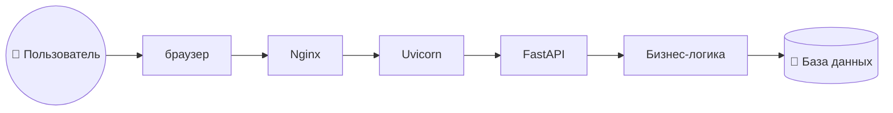

# Приложение для работы с базой
[swagger](http://localhost:8000/docs#/)
## Стек 
1. FastAPI
2. PostgreSQL
## Общая логика ПО
чтобы отображалось корректно установи ***mermaid*** в IDE


## Способы запуска
1. описание
   ```bash
    fastapi dev app_main.py
    ```
2. описание
    ```bash
   unicorn main:app_auth --reload
   ```
3. описание
   ```bash
   python app_main.py
   ```
   

# app_auth
```bash
  alembic -c src/app_auth/alembic.ini revision --autogenerate -m "init auth schema"
```


# Запуск тестов

## app_systems
```bash
    pytest tests/app_systems/test_api.py -v
```